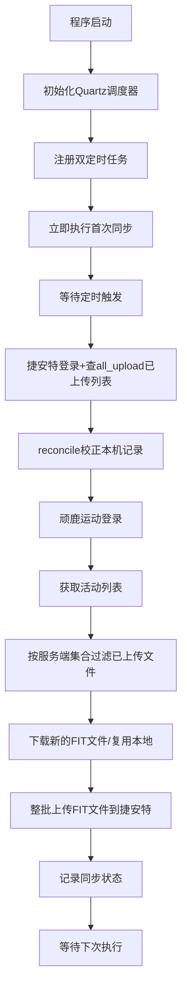

# 顽鹿运动FIT文件同步至捷安特骑行项目文档

## 目录
1. [项目概述](#项目概述)
2. [技术架构](#技术架构)
3. [核心功能](#核心功能)
4. [系统设计](#系统设计)
5. [配置管理](#配置管理)
6. [部署指南](#部署指南)
7. [运维监控](#运维监控)
8. [安全分析](#安全分析)
9. [性能优化](#性能优化)
10. [问题与改进建议](#问题与改进建议)
11. [附录](#附录)

---

## 项目概述

### 项目简介
本项目是一个Java开发的自动化工具，用于将顽鹿运动（Onelap）平台的骑行记录（FIT文件）自动同步到捷安特骑行（Giant）平台。该项目解决了本人在两个不同骑行平台间手动同步数据的繁琐操作问题。

### 项目背景
- **开发者背景**：本人拥有捷安特品牌自行车，早期使用捷安特官方APP记录骑行数据
- **需求转变**：后期购买了迈金码表，发现顽鹿运动的数据分析功能更适合个人需求
- **数据迁移痛点**：已有部分历史数据存储在捷安特平台，无法直接迁移到顽鹿运动
- **解决方案**：利用顽鹿运动支持导出FIT文件的功能，开发自动化同步工具

### 核心价值
- ✅ **自动化同步**：无需人工干预，定时自动完成数据同步
- ✅ **多端一致去重**：以捷安特`all_upload`服务端已上传列表为唯一事实源判定，多端（桌面/Android）同时运行不会重复上传（见 [跨端同步设计](../docs/design/multi-client-sync.md)）
- ✅ **Token 缓存**：捷安特/顽鹿 token 懒失效缓存 + 自动续登重试，不再每次任务重新登录
- ✅ **双向支持**：支持Onelap→Giant正向同步和本地文件上传到Onelap的反向功能
- ✅ **轻量化设计**：使用嵌入式SQLite（sqlite-jdbc）做本机记账，无需外部数据库服务

---

## 技术架构

### 技术栈选型
| 组件 | 版本 | 用途 |
|------|------|------|
| Java | 8 | 核心开发语言 |
| Maven | 3.x | 项目构建和依赖管理 |
| Quartz Scheduler | 2.3.2 | 定时任务调度 |
| Apache HttpClient (httpmime) | 4.5.14 | HTTP客户端请求 |
| Fastjson2 | 2.0.43 | JSON数据解析 |
| SQLite JDBC (xerial) | 3.45.3.0 | 嵌入式同步记录数据库 |
| Logback | 1.2.13 | 日志输出（控制台+按天滚动文件） |
| Apache Commons Lang3 | 3.18.0 | 字符串和通用工具类 |
| Apache Commons Collections4 | 4.4 | 集合操作工具类 |
| JUnit | 4.13.1 | 单元测试 |

### 项目结构
```
synchronizeTheRecordingOfOnelapToGiant/
├── src/
│   ├── main/
│   │   ├── java/com/dream/mryang/syncTheRecordingOfOnelapToGiant/
│   │   │   ├── Main.java                          # 主程序入口和定时任务
│   │   │   ├── UploadToOnelapMain.java            # 反向上传工具
│   │   │   ├── service/                           # 业务服务包
│   │   │   │   ├── OnelapService.java             # 顽鹿运动：登录/列表/详情/下载
│   │   │   │   └── GiantBikeService.java          # 捷安特骑行：登录/批量上传
│   │   │   ├── db/
│   │   │   │   └── SyncRecordDao.java             # SQLite同步记录数据访问层
│   │   │   └── utils/                             # 工具类包
│   │   │       ├── ConfigManager.java             # 配置管理器
│   │   │       ├── HttpClientUtil.java            # HTTP客户端工具（连接池+超时）
│   │   │       └── SyncConstants.java             # 外部接口地址等常量
│   │   └── resources/
│   │       ├── config.properties                  # 配置文件
│   │       └── logback.xml                        # 日志配置
│   └── test/
│       └── java/.../db/SyncRecordDaoTest.java     # SyncRecordDao单元测试
├── docs/                                          # 设计文档（SQLite同步记录设计等）
├── target/                                        # 编译输出目录
├── pom.xml                                        # Maven配置文件
├── README.md                                      # 项目说明文档
└── PROJECT_DOCUMENTATION.md                       # 项目完整文档
```

### 架构设计
```
┌─────────────────────────────────────────────────────────────────┐
│                        应用层 (Application Layer)                │
├─────────────────────────────────────────────────────────────────┤
│  ┌─────────────┐    ┌──────────────────┐    ┌────────────────┐ │
│  │   Main      │◄──►│ TaskJob (Quartz) │    │ UploadToOnelap │ │
│  │  (主程序)   │    │   (定时任务)     │    │   (反向上传)   │ │
│  └─────────────┘    └──────────────────┘    └────────────────┘ │
└─────────────────────────────────────────────────────────────────┘
                                │
                                ▼
┌─────────────────────────────────────────────────────────────────┐
│                        服务层 (Service Layer)                    │
├─────────────────────────────────────────────────────────────────┤
│  ┌──────────────────┐    ┌──────────────────┐    ┌────────────┐ │
│  │  OnelapService   │    │ GiantBikeService │    │SyncRecordDao│ │
│  │ (下载FIT文件)    │    │ (批量上传FIT)    │    │(SQLite记录)│ │
│  └──────────────────┘    └──────────────────┘    └────────────┘ │
└─────────────────────────────────────────────────────────────────┘
                                │
                                ▼
┌─────────────────────────────────────────────────────────────────┐
│                        工具层 (Utility Layer)                    │
├─────────────────────────────────────────────────────────────────┤
│  ┌──────────────────┐    ┌──────────────────┐    ┌────────────┐ │
│  │ HttpClientUtil   │    │  SyncConstants   │    │ConfigManager│ │
│  │ (HTTP客户端)     │    │ (接口地址常量)   │    │ (配置管理) │ │
│  └──────────────────┘    └──────────────────┘    └────────────┘ │
└─────────────────────────────────────────────────────────────────┘
                                │
                                ▼
┌─────────────────────────────────────────────────────────────────┐
│                        外部系统 (External Systems)               │
├─────────────────────────────────────────────────────────────────┤
│  ┌──────────────────┐                           ┌──────────────┐ │
│  │  顽鹿运动平台    │◄─────────────────────────►│ 捷安特平台   │ │
│  │ (Onelap)        │    RESTful APIs           │ (Giant)      │ │
│  │  • 本人认证     │                           │  • 本人认证  │ │
│  │  • 活动列表     │                           │  • 文件上传  │ │
│  │  • 文件下载     │                           │              │ │
│  └──────────────────┘                           └──────────────┘ │
└─────────────────────────────────────────────────────────────────┘
```

---

## 核心功能

### 1. 定时同步功能
- 使用Quartz调度器实现双Cron表达式定时任务
- 支持灵活的时间调度配置
- 程序启动时立即执行一次同步任务

### 2. 顽鹿运动集成
- 实现登录认证和签名机制
- 获取本人活动列表
- 下载FIT文件到本地存储

### 3. 捷安特骑行集成
- 本人登录认证
- 批量上传FIT文件
- 响应状态验证

### 4. 跨端去重与生命周期记录
- **去重以捷安特服务端为事实源**：每次会话调一次`all_upload`取回已上传文件名集合，顽鹿活动的`fitUrl`在集合中出现过（任意状态）即跳过
- SQLite单表`sync_record`降级为**本机记账/排查层**，不再承担去重职责；状态：`DOWNLOADED` / `SYNCED` / `UPLOAD_FAILED` / `DOWNLOAD_FAILED` / `PROCESS_FAILED`
- **失败自然重试**：下载/上传失败的文件在服务端无记录，下次会话自然重试（任一端都可能完成）；写入改为 upsert，同一`fit_url`重试不再撞唯一键
- **处理失败标红**：服务端「已上传但处理失败」（`PROCESS_FAILED`）不自动重传，日志`ERROR`级明确输出待人工处理
- **reconcile 校正**：每次会话开头依据`all_upload`结果校正本机`SYNCED`/`UPLOAD_FAILED`记录的真实状态
- 下载阶段单条失败只记录、不中断整个任务；本地已下载且文件仍在则复用不重复下载

### 5. 反向上传功能
- 支持将本地FIT文件上传到顽鹿运动
- 处理上传并发问题
- 提供上传进度反馈

---

## 系统设计

### 核心组件详解

#### 1. 主程序类 (Main.java)
**功能职责：**
- 启动时初始化SQLite同步记录库（`SyncRecordDao.init()`建库建表）
- 初始化Quartz调度器，配置双Cron表达式定时任务（`@DisallowConcurrentExecution`禁止并发执行）
- 任务体串联`OnelapService`下载与`GiantBikeService`上传

**关键特性：**
```java
// 双定时器配置
Trigger trigger1 = TriggerBuilder.newTrigger()
    .withSchedule(CronScheduleBuilder.cronSchedule("0 0 0/6 * * ?"))  // 每6小时执行
    .build();
    
Trigger trigger2 = TriggerBuilder.newTrigger()
    .withSchedule(CronScheduleBuilder.cronSchedule("0 0/15 8-9 * * ?"))  // 早高峰时段密集执行
    .build();
```

#### 2. 配置管理器 (ConfigManager.java)
**设计理念：**
- 静态初始化块加载配置文件
- 运行时验证配置完整性
- 统一的配置访问接口

#### 3. HTTP客户端工具 (HttpClientUtil.java)
**设计要点：**
- 单例`CloseableHttpClient` + `PoolingHttpClientConnectionManager`连接池（maxTotal=50，每路由10）
- 统一超时配置：连接10秒、socket 30秒
- 提供`doPost`（接收任意`HttpEntity`：JSON/表单/multipart）、`doGet`、`downloadFile`三类方法

#### 4. 同步记录数据访问层 (SyncRecordDao.java)
**设计要点：**
- SQLite常驻单连接 + WAL模式，所有公开方法`synchronized`保证线程安全
- 单表`sync_record`，`fit_url`唯一键；**降级为本机记账层**，去重职责已移交捷安特服务端
- 写入均为 upsert（`ON CONFLICT(fit_url) DO UPDATE`），支持失败后自然重试：`upsertDownloaded`/`upsertDownloadFailed`
- reconcile 相关：`findReconcilable`（取`SYNCED`/`UPLOAD_FAILED`记录）、`updateStatus`（校正状态，首次转`SYNCED`补`sync_time`）
- 详细设计见 `docs/superpowers/specs/2026-06-03-sqlite-sync-record-design.md` 与 `docs/superpowers/plans/2026-07-07-server-side-dedup-and-token-cache.md`

#### 5. Token 缓存 (TokenCache.java) 与 all_upload 解析 (AllUploadSummary.java)
**设计要点：**
- `TokenCache`：懒登录缓存 token；业务调用抛`AuthFailedException`（401/403 或响应 status 异常）时清缓存 → 重新登录 → 重试一次，仍失败则上抛
- `AllUploadSummary.parse`：解析`all_upload`，构建`uploaded`（出现过的全部文件名）与`failedProcess`（全部处理非成功的文件→状态文案）；同名多条任一「成功」即成功
- `SyncLogic`：`reconcileTarget`纯逻辑 + `reconcileLocal`落库校正，与 Android 端同规则

### 业务流程详解

#### 正向同步流程 (Onelap → Giant)


> Token 缓存：捷安特登录仅首次发生，`all_upload`与上传复用同一 token；失效时自动续登重试一次。

#### 详细步骤说明

##### 步骤1：顽鹿运动登录认证
```java
// 签名计算（签名密钥从配置文件 onelap.sign.key 读取）
String sign = DigestUtils.md5Hex(
    "account=" + account +
    "&nonce=" + nonce +
    "&password=" + passwordParam +
    "&timestamp=" + timestamp +
    "&key=" + ConfigManager.getProperty("onelap.sign.key")
);

// 请求头封装
headers.put("nonce", nonce);
headers.put("timestamp", timestamp);
headers.put("sign", sign);
```

##### 步骤2：活动列表获取与过滤
```java
// 按日期范围查询最近 sync.recent.days 天的活动：先查一次拿 total，
// 再用 total 作为 limit 一次性取回全部列表

// 以捷安特服务端 all_upload 集合做去重（多端事实源，本地库不参与判断）
if (uploadedOnServer.contains(fitUrl)) {
    continue; // 服务端已有记录，跳过
}
```

##### 步骤3：文件下载与存储
```java
// 本地已下载/上传失败且文件仍在则复用，否则携带 Authorization 头下载
// （fitUrl 需 Base64 编码后拼接到下载地址）
HttpClientUtil.downloadFile(SyncConstants.ONELAP_FIT_DOWNLOAD_URL + fitUrlBase64, authHeaders, file);
// upsert 记账：成功记 DOWNLOADED（失败重试不撞唯一键），失败记 DOWNLOAD_FAILED 并继续下一条
SyncRecordDao.upsertDownloaded(fitUrl, account, file.length());
```

##### 步骤4：捷安特平台上传
```java
// 多文件批量上传
MultipartEntityBuilder builder = MultipartEntityBuilder.create();
for (String fileName : fileNames) {
    File file = new File(storageDirectory + fileName);
    builder.addBinaryBody("files[]", file, ContentType.DEFAULT_BINARY, fileName);
}
```

---

## 配置管理

### 配置文件详解 (config.properties)

#### 日常同步配置
```properties
# 顽鹿运动账号信息
onelap.account=your_account
onelap.password=your_password

# 捷安特骑行账号信息  
giant.username=your_username
giant.password=your_password

# 顽鹿运动接口签名密钥（固定值）
onelap.sign.key=fe9f8382418fcdeb136461cac6acae7b

# 同步策略配置
sync.recent.days=30                     # 同步最近30天的活动记录
onelap.fit.file.storage.directory=/path/to/storage/
sync.db.path=/path/to/sync_record.db    # SQLite同步记录库文件路径

# 定时任务配置
sync.cronone.expression=0 0 0/6 * * ?   # 每6小时执行
sync.crontwo.expression=0 0/15 8-9 * * ? # 早8-9点每15分钟执行

# 日志文件存储路径（被logback.xml引用）
log.file.path=/path/to/logs/
```

#### 反向上传配置
```properties
# 上传目标路径
upload.toonelap.path=/path/to/local/files/

# 顽鹿运动认证信息（页面获取）
upload.toonelap.token=page_token_value
upload.toonelap.cookie=page_cookie_value
```

---

## 部署指南

### 环境要求
- **操作系统**：Windows/Linux/macOS
- **Java版本**：JDK 8 或更高版本
- **磁盘空间**：根据同步频率预留足够存储空间
- **网络环境**：能够访问顽鹿运动和捷安特骑行API

### 部署步骤

#### 1. 环境准备
```bash
# 确保已安装Java 8+
java -version

# 确保已安装Maven
mvn -version
```

#### 2. 配置文件设置
编辑 `src/main/resources/config.properties`：
```properties
# 顽鹿运动账号（必填）
onelap.account=你的顽鹿运动账号
onelap.password=你的顽鹿运动密码

# 捷安特骑行账号（必填）
giant.username=你的捷安特账号
giant.password=你的捷安特密码

# 存储路径配置（根据系统调整）
onelap.fit.file.storage.directory=/path/to/storage/
sync.db.path=/path/to/sync_record.db
log.file.path=/path/to/logs/
```

注意：配置文件位于`src/main/resources/`，打包后固化在jar内，修改配置需重新打包。

#### 3. 构建运行
```bash
# 编译打包
mvn clean package

# 运行程序
java -jar target/synchronizeTheRecordingOfOnelapToGiant-1.0.0.jar
```

### 目录结构规划
```
/sync-app/
├── bin/                    # 可执行JAR文件
├── logs/                   # 日志文件目录
├── data/                   # 数据存储目录
│   ├── sync_record.db      # SQLite同步记录库（程序自动创建）
│   └── onelapFitFileStorageDirecotry/
│       └── *.fit           # 下载的FIT文件
└── backup/                 # 备份目录
```

---

## 运维监控

### 健康检查脚本
```bash
#!/bin/bash
# 检查进程是否运行
if pgrep -f "syncTheRecordingOfOnelapToGiant" > /dev/null; then
    echo "应用运行正常"
else
    echo "应用异常停止，尝试重启..."
    # 重启逻辑...
fi

# 检查磁盘空间
df -h /path/to/data/ | awk 'NR==2 {if($5+0 > 80) print "磁盘空间不足"}'
```

### 常见问题诊断

#### 1. 配置文件加载失败
```bash
# 检查配置文件路径
ls -la /path/to/config.properties
# 验证文件权限
chmod 644 config.properties
```

#### 2. 网络连接问题
```bash
# 测试API连通性
curl -I https://www.onelap.cn/api/login
curl -I https://ridelife.giant.com.cn/index.php/api/login
```

#### 3. 文件权限问题
```bash
# 检查存储目录权限
ls -ld /path/to/storage/
chmod 755 /path/to/storage/
```

---

## 安全分析

### 当前安全措施

#### 1. 签名认证机制
- 顽鹿运动登录采用签名认证
- 签名包含随机nonce、时间戳等防重放攻击要素
- 签名密钥已配置化（`onelap.sign.key`，接口要求的固定值）

#### 2. 配置隔离
- 敏感信息集中存储在配置文件中
- 仓库中账号密码字段留空，本地填入真实凭据后注意不要提交
- 运行时验证配置完整性（缺失或空值直接抛异常）

### 已识别安全风险

| 风险类型 | 当前状态 | 建议改进 |
|----------|----------|----------|
| MD5算法使用 | ⚠️ 存在风险（接口协议要求） | 受限于对方接口，暂无法更换 |
| 明文密码存储 | ⚠️ 存在风险 | 建议加密存储 |
| 敏感信息日志 | ⚠️ 存在风险 | 生产环境应脱敏 |

### 安全改进建议

#### 短期改进（高优先级）
1. **密码加密存储**：使用AES等加密算法存储敏感信息
2. **日志脱敏处理**：敏感信息输出时进行脱敏处理

#### 中长期规划
1. 集成配置中心（如Apollo、Nacos）
2. 实现密钥轮换机制
3. 添加HTTPS证书验证
4. 建立安全审计日志

---

## 性能优化

### 已落地的优化

#### 1. 网络请求
- `HttpClientUtil`使用单例连接池（maxTotal=50，每路由10）
- 统一超时设置：连接10秒、socket 30秒

#### 2. 同步记录存储
- 已由TXT文件迁移到SQLite：`fit_url`唯一索引去重（替代原O(n)线性扫描），写入具备事务原子性

#### 3. 并发控制
- `TaskJob`已加`@DisallowConcurrentExecution`禁止Quartz并发执行
- `SyncRecordDao`所有公开方法`synchronized`，单连接+WAL模式

### 遗留优化方向
- 文件下载仍为串行处理，量大时可考虑并行化
- 反向上传工具中固定2秒延时规避服务端并发问题，较为粗糙

---

## 问题与改进建议

### 已解决的历史问题

1. **硬编码签名密钥**：已移至配置文件`onelap.sign.key`
2. **HTTP客户端问题**：已重构为按`HttpEntity`类型统一的`doPost`/`doGet`/`downloadFile`方法，全部使用try-with-resources，配置了连接池与超时
3. **文件下载缺少认证**：下载FIT文件时已传递`Authorization`头
4. **同步记录去重与原子性**：TXT记录已迁移到SQLite，`fit_url`唯一键去重，写入具备事务原子性
5. **Quartz并发问题**：已加`@DisallowConcurrentExecution`
6. **失败无痕迹**：下载/上传失败均写入SQLite（`DOWNLOAD_FAILED`/`UPLOAD_FAILED`），单条下载失败不再中断整个任务
7. **测试缺失**：`SyncRecordDao`已有JUnit单元测试覆盖
8. **API端点分散**：外部接口地址已集中到`SyncConstants`常量类

### 仍存在的问题

#### 一、安全性问题
1. **MD5哈希算法使用**：受限于对方接口协议，暂无法更换
2. **明文密码存储**：配置文件中密码明文存储
3. **敏感信息日志输出**：完整API响应输出到日志

#### 二、功能逻辑问题
1. **上传响应处理简单**：`upload_fit`仅检查status==1，整批统一标记成败，无单文件粒度结果（真实处理结果由下次会话 reconcile 依据`all_upload`确认）
2. **并发窗口**：两端恰好同时同步时都查到「服务端没有」，可能同时上传同一文件；概率极低且服务端允许同名多条，不影响正确性（见 [跨端同步设计](../docs/design/multi-client-sync.md) §5）

#### 三、配置与部署问题
1. **配置固化在jar内**：修改配置需重新打包
2. **硬编码延时**：反向上传工具固定2秒延时处理服务端并发问题

### 改进建议

#### 中期建议（中优先级）
1. **增强安全性**：配置文件中密码加密存储，敏感信息日志脱敏
2. **配置外置化**：支持从jar外部路径加载config.properties，免去改配置重新打包
3. **添加监控和告警**：任务执行统计、失败记录告警

#### 长期建议（低优先级）
1. **失败重试策略**：为失败记录提供受控的重试机制或管理命令
2. **测试体系建设**：扩大测试覆盖（服务层）、实现持续集成
3. **部署和运维改进**：容器化部署

---

## 附录

### API接口文档

#### 顽鹿运动相关接口
| 接口 | 地址 | 方法 | 用途 |
|------|------|------|------|
| 本人登录 | https://www.onelap.cn/api/login | POST | 获取认证令牌（需nonce/timestamp/sign签名头） |
| 活动列表 | https://u.onelap.cn/api/otm/ride_record/list | POST | 按日期范围分页获取骑行活动列表 |
| 活动详情 | https://u.onelap.cn/api/otm/ride_record/analysis/{id} | GET | 获取活动详情（含fitUrl） |
| 文件下载 | https://u.onelap.cn/api/otm/ride_record/analysis/fit_content/{fitUrl的Base64} | GET | 下载FIT文件 |
| 文件上传 | https://u.onelap.cn/upload/fit | POST | 反向上传FIT文件（需页面token/cookie） |

#### 捷安特骑行相关接口
| 接口 | 地址 | 方法 | 用途 |
|------|------|------|------|
| 本人登录 | https://ridelife.giant.com.cn/index.php/api/login | POST | 获取本人令牌 |
| 文件上传 | https://ridelife.giant.com.cn/index.php/api/upload_fit | POST | 上传FIT文件 |
| 已上传列表 | https://ridelife.giant.com.cn/index.php/api/all_upload | POST | 全量已上传文件列表（多端去重事实源） |

### 常用命令参考

#### Maven构建命令
```bash
# 清理并编译
mvn clean compile

# 打包可执行JAR
mvn package

# 运行全部测试 / 单个测试类
mvn test
mvn test -Dtest=SyncRecordDaoTest

# 运行程序
java -jar target/synchronizeTheRecordingOfOnelapToGiant-1.0.0.jar
```

#### Git操作命令
```bash
# 查看提交历史
git log --oneline -10

# 查看文件变更
git diff HEAD~1 HEAD

# 创建发布标签
git tag -a v1.0.0 -m "Release version 1.0.0"
git push origin v1.0.0
```

### 参考资料
- [Quartz Scheduler官方文档](http://www.quartz-scheduler.org/documentation/)
- [Apache HttpClient本人指南](https://hc.apache.org/httpcomponents-client-ga/)
- [Fastjson2使用手册](https://github.com/alibaba/fastjson2)
- [SQLite JDBC (xerial)](https://github.com/xerial/sqlite-jdbc)
- [Cron表达式在线生成器](https://www.freeformatter.com/cron-expression-generator-quartz.html)

---

**文档版本**：v1.2  
**最后更新**：2026年7月7日（跨端服务端去重 + Token 缓存改造）  
**维护者**：yang.yang  
**项目状态**：稳定运行中